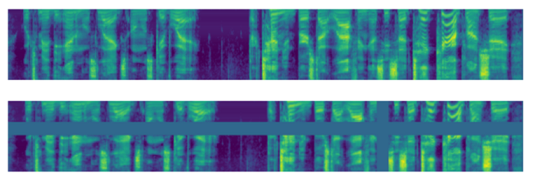

---
tasks:
- acoustic-noise-suppression
widgets:
- task: acoustic-noise-suppression
  inputs:
  - type: audio
    name: input
    title: 带噪音的原始音频
    displayProps:
      sampleRate: 48000
    validator:
      max_size: 10M
  output:
    displayProps:
      sampleRate: 48000
  examples:
  - name: 1
    title: 示例1
    inputs:
    - name: input
      data: git://examples/speech_with_noise_48k.wav
  inferencespec:
    cpu: 1
    memory: 1000
    gpu: 0
    gpu_memory: 1000
model_type:
- complex-nn
domain:
- audio
frameworks:
- pytorch
model-backbone:
- dfsmn
customized-quickstart: True
license: Apache License 2.0
tags:
- Alibaba
- Mind DNS
- ANS
- AI降噪
- 语音增强
- 音频前处理
- 3A

---

# DSFMN语音降噪模型介绍
我们日常可能会碰到需要在噪杂的环境里进行音视频通话或录制语音，比如在噪杂的地铁或者巴士上通话，为了让对方听清楚，不得不提高嗓门和音量；再比如想录制一段干净的语音却发现周围都很吵，录制的语音里往往混杂着噪声。这都是因为环境噪声的影响，使我们在使用语音应用时出现障碍。这是语音通讯中一个普遍存在且又非常棘手的问题。语音质量（quality）和可懂度（intelligibility）容易受到环境噪声、拾音设备、混响及回声的干扰，使通话质量和交流效率大幅降低，如何在嘈杂的环境中保持较高的语音通话质量和可懂度一直以来是众多企业和学者追求的目标。
语音降噪算法的作用是从受污染的语音中提取目标语音，还原目标语音质量和可懂度。语音降噪算法通过多年研发积累，已经取得一定的突破，尤其针对复杂环境中的语音降噪问题，基于深度算法的语音降噪模型在性能上获得大幅度的提升，在保障更小语音失真度的情况下，最大限度地消除背景噪声，还原目标语音的清晰度，语音降噪模型也通常被叫做语音增强模型。
我们推出的DFSMN语音降噪模型首次支持音视频会议48k采样率的语音降噪，目标是抑制目标说话人语音以外的其他各类环境噪声（比如啸叫，手机铃声，键盘声，背景人声，吃零食声，关门声等）。我们在模型设计中考虑到如下具体挑战：包括音视频会议对模型参数量、计算量、和实时性要求高；由于音视频会议的交流性质，对语音的质量和可懂度要求高；语音的噪声环境复杂，噪声类型多样，对模型的泛化能力要求高；说话人和麦克风距离不固定，语音存在大小音量的变化，对模型的辨识能力要求高；根据接入设备不同，存在语音采样率的变化（包含8kHz, 16kHz, 48kHz等），对模型可处理不同频率段的要求高。我们针对以上挑战做了相应的模型设计和训练方法，基于先进的DFSMN模型架构和Teacher-Student训练方法，不仅可以达到模型实时降噪处理，而且最大限度地降低语音失真，显著消除音频中的噪声和混响部分，让使用者最终摆脱环境噪声的烦恼。

## 模型描述

DFSMN语音降噪模型采用序列到序列的学习模式和非循环带记忆的前向深度神经网络架构，利用高复杂度的Encoder-Decoder模型架构作为Teacher模型， 并使用先进的SpectralAug动态数据扩充方法，加上针对48k语音的magFFT Loss权重优化技巧，人工筛检各种干净语音和噪声数据，使用针对会议场景的训练数据模拟和小音量语音的保护算法，均衡配比各类语音噪声数据，对智能降噪模型进行联合优化（见图1）。

<div align=center>

</div>
<center>图1 智能降噪模型进行联合优化方案图示</center>

#### 序列到序列学习模式
序列到序列（sequence to sequence）学习模式在现今序列学习任务上有着广泛的应用，如在机器翻译，语音识别等任务上起着主导地位。 语音是时间域上的有序序列，存在明显的前后关系，非常适合使用序列到序列建模模式。 语音增强降噪任务是在保障语音内容不丢失的情况下，去除掺杂的噪声，研究发现噪声混合能量可以用时频域的频谱掩蔽（Mask）很好的表达。 我们基于从Fbank特征序列到频谱的掩蔽（Mask）序列进行建模和学习（图2）：

<div align=center>

</div>
<center>图2 序列到序列学习模式</center>

#### 深度前馈序列记忆神经网络架构（DFSMN）
循环神经网络是一种功能强大的带记忆神经网络，基于其自身的内部记忆和信息循环传递特点，被广泛应用到序列到序列（seq2seq）学习任务上，尤其是其变种长短时记忆网络（LSTM：long short-term memory）效果显著。 但LSTM存在学习复杂度高，学习梯度消失或爆炸等训练问题。 为了避免以上问题，我们在降噪模型设计中使用一种具有RNN特性的深度前馈序列记忆网络（ DFSMN: deep feedforward sequential memory networks ），不仅拥有高效的学习能力和训练效率，而且有优秀的降噪性能表现。 FSMN网络在前馈神经网络中通过添加记忆模块获得信息存储能力（图3）：

<div align=center>

</div>
<center>图3 DFSMN网络架构示意图</center>

DFSMN网络层具体计算模式，其中N<sub>1</sub>为后看时间序列数，N<sub>2</sub>为前看时间序列数：

<div align=center>

</div>

#### 高复杂度Encoder-Decoder Teacher模型
在线语音增强降噪任务要求模型低复杂度和实时性等性能，因而网络结构不能太复杂。为了更有效地优化小模型的学习能力。我们采用Teacher-student学习模式。该学习模式的思路是使用一种结构复杂的teacher模型在训练集上进行学习，然后使用学到的teacher网络重新对训练集进行预测，得到训练集的预测标签，基于预测标签训练student模型。我们结合语音合成任务的一种Encoder-Decoder网络架构FastSpeech, 以及结合CNN和BLSM网络结构，分别从时域和频域上进行建模，能更有效地学习语音结构。FastSpeech模型架构是为了进行高效的语音合成而提出的，其设计继承了Tacotron和Transformer的理念，但改进了模型的部件，大大提升了语音合成的速度。我们使用改进的FastSpeech模型作为Teacher模型进行语音增强训练。模型部件主要包括1-D卷积层，双向LSTM， 以及线性前馈神经网络。Encoder由3层1-D卷积层和1个双向LSTM构成；Decoder由5层1-D卷积层，1个双向LSTM和1层线性前馈神经网络构成，模型输出端添加Sigmoid把输出范围固定在0到1之间 （图4）：

<div align=center>

</div>
<center>图4 基于FastSpeech架构的Teacher模型</center>


#### 基于magFFT 优化函数权重
训练数据中48k语音和噪声的高频能量普遍偏低，有些录音的采样率低于48kHz，通过升采样到48kHz，实验发现高频部分的掩蔽值波动大，对模型优化产生一定负面影响。我们结合带噪语音的log幅度谱对目标损失函数进行加权，有效消除高频的掩蔽值干扰，提升模型优化结果。

<div align=center>

</div>

#### SpecAug动态数据扩充
我们采用一种SpecAug的简单高效的数据扩增方法，扩增策略把声谱图当作图像一样进行处理， 随机掩盖一段连续的时间步长或梅尔频率通道（见下图）。我们根据60%的概率随机应SpecAug 扩充，把频率通道的屏蔽限制在2kHz以上，时间步长的屏蔽限制在1s以内。

<div align=center>

</div>
<center>图5: SpecAug动态数据扩展示意图</center>


## 模型的使用方式

模型pipeline 输入为一个48000Hz采样率的单声道wav文件，内容是带噪声的说话声，输出结果是纯净人声的单声道音频。

推荐用户在modelscope提供的docker环境中开发，其中已经安装好了所有必须依赖。如果您要在自己的环境中开发，请按如下步骤准备环境。

#### 环境准备

* 本模型支持Linux，Windows和MacOS平台。
* 本模型依赖开源库SpeechBrain，由于它对PyTorch版本依赖比较苛刻，因此没有加入ModelScope的默认依赖中，需要用户手动安装：

```shell
# 如果您的PyTorch版本>=1.10 安装最新版即可
pip install speechbrain
# 如果您的PyTorch版本 <1.10 且 >=1.7，可以指定如下版本安装
pip install speechbrain==0.5.12
```

* 本模型还使用了三方库SoundFile进行wav文件处理，**在Linux系统上用户需要手动安装SoundFile的底层依赖库libsndfile**，在Windows和MacOS上会自动安装不需要用户操作。详细信息可参考[SoundFile官网](https://github.com/bastibe/python-soundfile#installation)。以Ubuntu系统为例，用户需要执行如下命令:

```shell
sudo apt-get update
sudo apt-get install libsndfile1
```

#### 代码范例

```python
from modelscope.pipelines import pipeline
from modelscope.utils.constant import Tasks


ans = pipeline(
    Tasks.acoustic_noise_suppression,
    model='damo/speech_dfsmn_ans_psm_48k_causal')
result = ans(
    'https://modelscope.cn/api/v1/models/damo/speech_dfsmn_ans_psm_48k_causal/repo?Revision=master&FilePath=examples/speech_with_noise_48k.wav',
    output_path='output.wav')
```

#### 模型局限性

本模型主要针对近距离麦克风采集语音的场景（小于0.5米）具有较理想的噪声抑制表现，并可以较好地保障较低的语音失真，如果进行远距离麦克风的语音降噪测试（大于0.5米），由于混响情况加重，本模型对混响语音处理能力有限，可能会产生一定程度的语音失真或小音量语音误消除情况。

## 训练数据介绍
我们从多个渠道收集纯语音和纯噪声数据，语音数据包括TTS音库，ASR音库，开源音库和YouTube音频等，噪声数据主要来源为开源噪声库和内部录制特定噪声集，并对噪声数据进行了人工清理。数据模拟算法上我们根据信噪比混合干净语音和噪声音频，生成带噪语音音频，我们按一定比例随机在语音中加入小音量语音，并混合不同采样率的语音和噪声，具体配比见下图。

<div align=center>

</div>
<center>图6: 模型训练的数据配比示意图</center>


## 数据评估及结果


### 指标说明：

* MOS (Mean Opinion Score) 平均意见得分，是一种主观质量指标，在所有试听人员的评分上求平均得到最终结果，分数范围0-5，越高越好。

#### 相关论文以及引用信息
